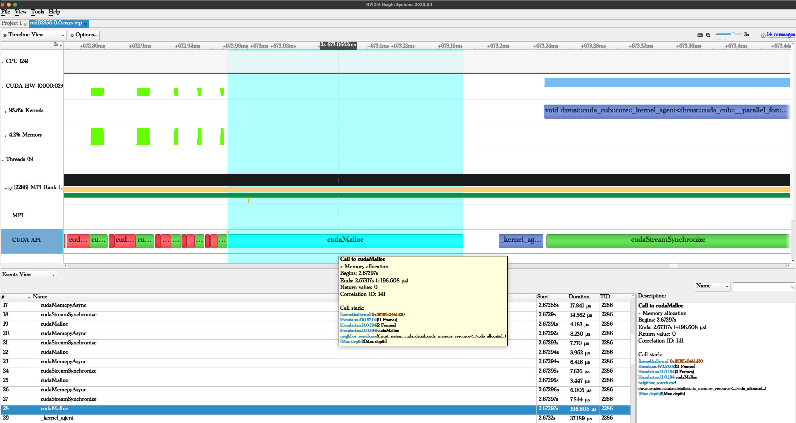

=================
Performance tools
=================

This section gives an overview of the gpu performance analysis tools
available on Piz Daint. Feel free to contact us on ``#profiler_questions``
or ``#cluster_support_pizdaint`` in Slack for more information.

Nvidia nsight
=============

- `Nsight™ Systems <https://developer.nvidia.com/nsight-systems>`__ is NVIDIA®
  system-wide performance analysis tool. It is installed on Piz Daint.
  It is recommended to download and install it on your laptop.

  .. warning::

     `Nsight™ Compute <https://developer.nvidia.com/nsight-compute>`__ is
     `not supported <https://docs.nvidia.com/cuda/profiler-users-guide/index.html#migrating-to-nsight-tools>`__  
     on P100 gpus.

- `nvprof <https://docs.nvidia.com/cuda/profiler-users-guide/index.html#profiling-modes>`__
  and `NVVP <https://developer.nvidia.com/nvidia-visual-profiler>`__ are
  NVIDIA® previous generation profiler and gui.

  .. warning::

     NVVP and nvprof will be deprecated in future CUDA
     releases. It is recommended to use `Nsight Systems` (nsys).

Load nsys on Piz Daint
----------------------

To use **Nsight Systems** on Piz Daint (with for example PrgEnv-gnu), load the
following modulefiles:

   .. code-block::

      module swap PrgEnv-cray PrgEnv-gnu
      module load nvhpc-nompi/22.2

This will load nsys version **2021.5** (and nvcc/11.6.55). If you need a more
recent version, run:

   .. code-block::

      module use /apps/daint/UES/eurohack/modules/all
      module load nsys/2022-3

This will load nsys version **2022.3.4**.

Run a job with nsys on Piz Daint
--------------------------------

An example job is:

   .. code-block::

      nsys_opt1='profile --force-overwrite=true'
      nsys_opt2='-o %h.%q{SLURM_NODEID}.%q{SLURM_PROCID}.qdstrm'
      nsys_opt3='--trace=cuda,mpi,nvtx --mpi-impl=mpich --stats=true --delay=2'
      #
      srun nsys $nsys_opt1 $nsys_opt2 $nsys_opt3 ./myexe -- myexe_args

You may also want to track the GPU memory usage with the
``'--cuda-memory-usage=true'`` flag. This feature may cause significant runtime
overhead. You can also deactivate cpu reporting with ``'--sample=none'``.

    .. note::

       Get more informations about the tool with: ``nsys profile --help``

Open a report file with nsys on your laptop
-------------------------------------------

A succesfull completed job on Piz Daint will create 1 or more ***.nsys-rep** report
file(s). Transfer the files to your laptop with scp and open them with the
installed client.

.. 

.. cmake -DCMAKE_CXX_COMPILER=CC -DCMAKE_C_COMPILER=cc -S SPH-EXA.git -B build -DBUILD_TESTING=OFF -DBUILD_ANALYTICAL=OFF -DCMAKE_CUDA_FLAGS=-arch=sm_60
   cmake --build build -t sphexa-cuda -j
   srun -n1 -t1 -A `id -gn` -Cgpu build/main/src/sphexa/sphexa-cuda --init sedov -s 1 -n 30

